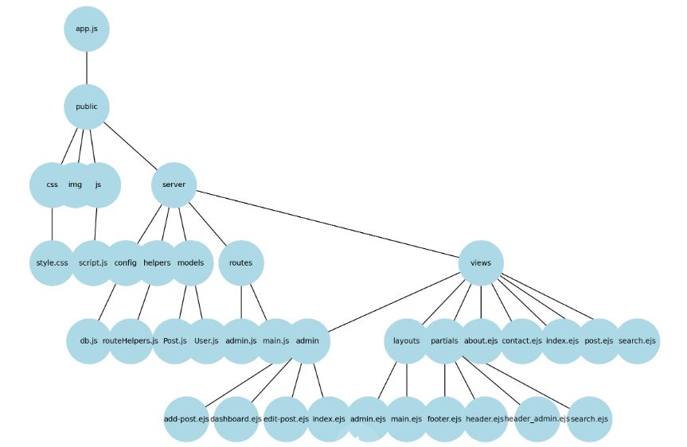

NodeBlog: A Node.js Express Blogging Platform

Description

NodeBlog is a fully functional blogging platform developed using Node.js, Express, and MongoDB. This project offers a comprehensive solution for creating, managing, and viewing blog posts. It features a clean and intuitive interface, catering to both blog owners and readers with a rich set of functionalities.

Features

CRUD Operations: Create, read, update, and delete blog posts.
User Authentication: Manage user access with a secure authentication system. Users can register and log in to access the admin panel.
Admin Panel: A secure admin panel for managing blog posts and user accounts.
Contact Form: Allows visitors to send messages to the blog owner, enhancing interaction and feedback.
Pagination: Efficiently navigate through blog posts.
Responsive Design: Ensures a great user experience on all devices.
Search Functionality: Enables users to search for specific blog posts.
Elegant UI: A user-friendly interface that's easy to navigate.
Technologies Used
Node.js: A JavaScript runtime built on Chrome's V8 JavaScript engine.
Express.js: A minimal and flexible Node.js web application framework.
MongoDB: A NoSQL database for handling blog data.
EJS: A templating language to generate HTML markup with plain JavaScript.
Installation

Clone the Repository

git clone https://github.com/Maesterfox/NodeBlog.git
cd NodeBlog

Install Dependencies

npm install
Configure MongoDB
Ensure MongoDB is set up and running.
Update the db.js file with your MongoDB URI, if necessary.

Start the Application

npm start

Usage

Once the application is running, it can be accessed at http://localhost:5000 (or your configured port). Use the admin panel to manage posts, view them on the blog's main page, and respond to user inquiries through the contact form.

Contributing

Contributions to NodeBlog are welcome! Feel free to fork the repository and submit pull requests.

License

This project is open source and available under the MIT License.

1. AWS EC2 Setup
Launch EC2 Instance: Choose an Amazon Machine Image (AMI), instance type, and configure instance details (like network and storage).
Configure Security Group: Set rules to allow inbound traffic on necessary ports. Typically, this includes:
HTTP (port 80)
HTTPS (port 443)
SSH (port 22) for remote access
Launch and Connect: Launch the instance and connect to it using SSH (e.g., with PuTTY or a similar SSH client).
2. Domain Configuration in IONOS
Update DNS Settings:
Set an A record in IONOS DNS settings to point your domain (e.g., blog.davidfoxdev.co.uk) to the public IP address of your EC2 instance.
Adjust TTL (Time to Live) as necessary.
3. Server and Application Setup
Install Node.js: Install the version of Node.js required for your application.
Deploy Your Application: Upload your application files and install dependencies.
Run the Application: Start your Node.js application (commonly on a non-standard port like 5000).
4. Nginx Installation and Configuration
Install Nginx: Use the package manager (yum or dnf) to install Nginx.
Configure Nginx as a Reverse Proxy: Set up Nginx to forward requests from port 80 (HTTP) to the port where your Node.js application is running.
Restart and Enable Nginx: Ensure Nginx is active and enabled to start on boot.
5. Obtaining an SSL Certificate with Let's Encrypt
Install Certbot: Install Certbot, a client for Let’s Encrypt.
Install Certbot Nginx Plugin: Install the Nginx plugin for Certbot (python3-certbot-nginx).
Run Certbot: Execute Certbot with the Nginx plugin to automatically obtain and configure SSL for your domain.
Verify Automatic Renewal: Test the renewal process to ensure Certbot will auto-renew the SSL certificate.
6. Final Steps and Verification
Adjust EC2 Security Group for HTTPS: Open port 443 if not already done.
Test the Website: Verify that the website is accessible via HTTP and HTTPS.
Monitor Application and Server: Regularly check the application and server for proper operation.